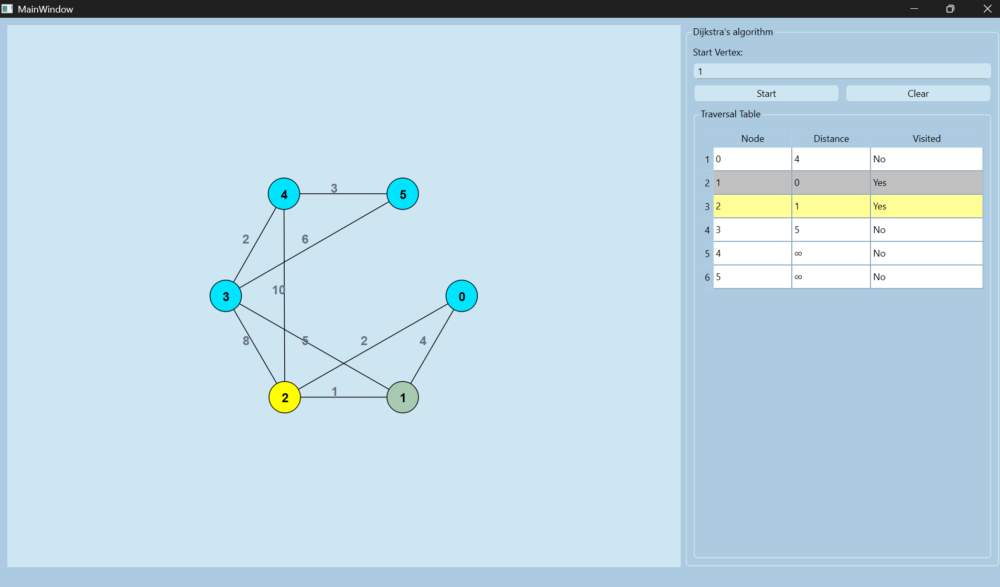

# Graphify

A sleek, interactive desktop application built with **C++** and the **Qt Framework** to visualize how Dijkstra's Algorithm finds the shortest path between nodes in real-time.

---

##  Overview

This project aims to display the inner workings of the Dijkstra (single source shortest-path) algorithm. By providing a graphical interface with user interactivity where the user can interact with the program and see the working of the algorithm visually.

---
### UI Interface
<p align ="center">

</p>


##  Features
* **Interactive:** User can interact visualize it the way they want.
* **Real-Time Table:** The table updates simultaneously with the visit of each node.
* **Real-Time Visualization:** Watch the algorithm expand from the source node.
* **Weighted Edges:** Add weights to specific cells to see how the path changes.
* **Responsive UI:** Built with Qt for a smooth, native desktop experience.

---

## Tech Stack

* **Language:** C++17
* **Framework:** Qt 6.x (or 5.15)
* **Build System:** CMake / qmake
* **Algorithm:** Dijkstra's Shortest Path

---

##  Getting Started

### Prerequisites

* **Qt Creator** or **Visual Studio** with Qt extension.
* **Qt 6.0+** installed on your system.
* **CMake** (recommended).

### Installation

1.  **Clone the repository:**
    ```bash
    git clone [https://github.com/Binaya764/Graphify.git]
    (https://github.com/yourusername/dijkstra-visualizer.git)
    cd dijkstra-visualizer
    ```

2.  **Open the project:**
    * Open `CMakeLists.txt` (or `.pro` file) in Qt Creator.
    
3.  **Build and Run:**
    * Select your kit (e.g., Desktop Qt 6.5.0 MSVC2019 64bit).
    * Press `Ctrl + R` to build and run the application.

---

## 📄 Project Report

[Click here to view the full report](./Project_Report/Graphify_Report.pdf)


